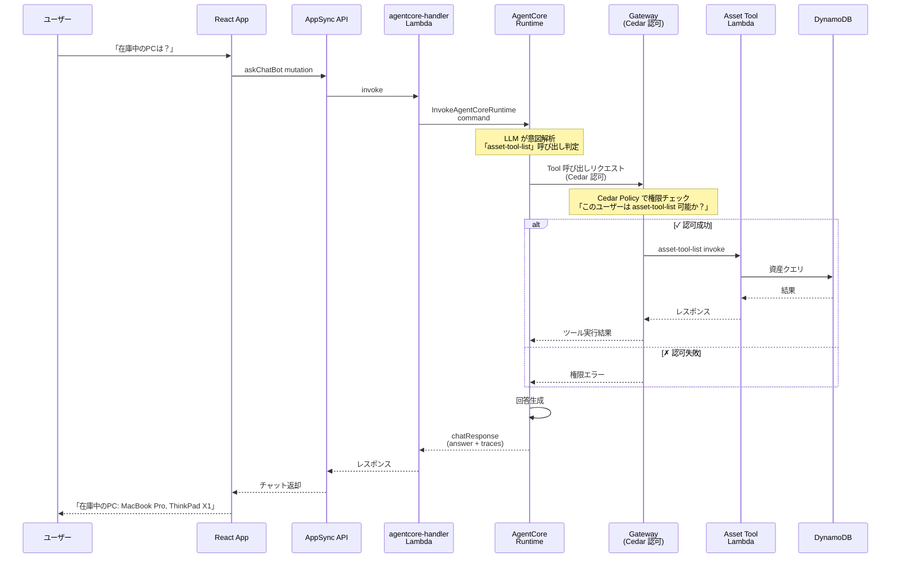

# Asset Catalog - アーキテクチャ詳細

このドキュメントでは、AI チャットボット・RAG・Cedar 認可を統合した資産管理アプリの技術設計を説明します。

---

## 1. AgentCore 統合 - AI チャットボット実装

### 概要

ユーザーの自然言語クエリ（例：「在庫中のノートPCは？」）を Amazon Bedrock AgentCore が解析し、適切な Lambda ツールを自動選択・実行します。

### 実装フロー



### Lambda ツール群（Gateway に登録）

| ツール | 説明 | Cedar 権限 |
|---|---|---|
| `asset-tool-list` | 資産一覧（フィルタ可） | viewer / editor / manager |
| `asset-tool-get` | 資産詳細 | viewer / editor / manager |
| `asset-tool-create` | 資産作成 | editor / manager |
| `asset-tool-update` | ステータス変更など | editor / manager |
| `asset-tool-delete` | 資産削除 | manager のみ |
| `asset-type-tool-list` | 資産種別一覧 | viewer / editor / manager |
| `asset-kb-search` | Knowledge Base 検索 | viewer / editor / manager |

---

## 2. RAG パイプライン - リアルタイムベクトル更新

### 概要

DynamoDB のデータ変更をリアルタイムに検知し、自動的に Bedrock Knowledge Base のベクトルストアに同期します。これにより、「修理品の在庫状況」のような曖昧なクエリにも即座に対応できます。

### データフロー

```
DynamoDB (Asset) 更新
        ↓
DynamoDB Streams
        ↓
Lambda: sync-asset （トリガー）
        ↓
S3: メタデータ + テキスト保存
        ↓
Bedrock Knowledge Base: Ingestion Job
        ↓
Titan Embeddings: ベクトル化
        ↓
S3 Vector Store: 1536次元ベクトル保存
        ↓
（ユーザークエリ時）
Bedrock KB: RetrieveAPI
        ↓
S3 Vector Store: ベクトル検索
        ↓
関連度の高い資産を返却
```

### Lambda: sync-asset の実装

```typescript
// amplify/function/sync-asset/index.ts
export const handler = async (event: DynamoDBStreamEvent) => {
  const s3Client = new S3Client({ region: "ap-northeast-1" });

  for (const record of event.Records) {
    if (record.eventName !== 'MODIFY' && record.eventName !== 'INSERT') continue;

    const asset = record.dynamodb!.NewImage!;
    const assetId = asset.id.S!;

    // S3 に保存用テキスト作成
    const assetText = `
      Asset ID: ${assetId}
      Type: ${asset.assetTypeId.S}
      Status: ${asset.status.S}
      Department: ${asset.departmentId.S}
      Assigned: ${asset.assigneeSub?.S || 'N/A'}
      Created: ${asset.createdAt.S}
    `;

    // S3 保存（Knowledge Base のデータソース）
    await s3Client.send(
      new PutObjectCommand({
        Bucket: KB_DATA_SOURCE_BUCKET,
        Key: `assets/${assetId}.txt`,
        Body: assetText,
      })
    );
  }
};
```

### Bedrock Knowledge Base 設定

```typescript
// amplify/bedrock/resource.ts
const knowledgeBase = new bedrock.KnowledgeBase(stack, 'AssetKB', {
  name: 'asset-catalog-kb',
  dataSourceBucket: dataSourceBucket,
  vectorStoreType: bedrock.VectorStoreType.OPENSEARCH_SERVERLESS,
  embeddingModel: bedrock.EmbeddingModel.TITAN_EMBED_TEXT_V1,
});
```

### セマンティック検索の例

```
ユーザー: 「修理中の機器が何台あるか」

Knowledge Base 検索:
  1. ユーザークエリをベクトル化
  2. S3 Vector Store との類似度計算
  3. status=inRepair の資産を重点的に取得

結果: 修理中の資産 3 台（Mac 1, PC 2）
```

---

## 3. Cedar Policy による認可制御

### 概念

**Cedar**: AWS が提供するポリシー言語。ABAC（属性ベースアクセス制御）をサポート。

Asset Catalog では Cedar Policy で以下を制御：

```
ユーザーの部署 + ロール → ツール呼び出し権限
```

### Cedar ポリシー定義

```cedar
// 例: viewer ロールは read-only
permit (
    principal in AssetCatalogRole::"viewer",
    action in [ReadAction],
    resource
)
when { resource.type == "Asset" };

// manager ロールは全権限
permit (
    principal in AssetCatalogRole::"manager",
    action,
    resource
)
when { resource.type == "Asset" };
```

### Gateway への登録

```typescript
// amplify/bedrock-agentcore/gateway/resource.ts
backend.defineBackend({
  // ...
  gatewayTargets: {
    // Cedar Policy Engine を紐付け
    policyEngine: cedarPolicyEngine,
    tools: [
      {
        name: "asset-tool-list",
        lambda: assetListFunction,
      },
      {
        name: "asset-tool-create",
        lambda: assetCreateFunction,
      },
      // ...
    ],
  },
});
```

### ツール実行時の認可フロー

```
AgentCore: ツール呼び出しリクエスト
        ↓
Gateway: 以下を参照
  - ユーザーの principal（部署 + ロール）
  - ツール名（action）
  - 資産リソース属性
        ↓
Cedar Policy Engine: ポリシー照合
        ↓
✓ permit → ツール実行
✗ deny  → 「権限がありません」エラー
```

---

## 4. データモデル設計

### DynamoDB スキーマ

```typescript
// AssetType: 資産種別マスタ
type AssetType {
  id: ID!                  // PK: UUID
  departmentId: String!    // GSI1 PK
  code: String!            // 品番
  name: String!            // PC、プリンタ等
  description: String
  sortOrder: Int
  createdAt: AWSDateTime!
  updatedAt: AWSDateTime!
}

// Asset: 資産
type Asset {
  id: ID!                  // PK: UUID
  departmentId: String!    // GSI1 PK
  assetTypeId: ID!         // AssetType 参照
  status: AssetStatus!     // inStock / lent / inRepair / disposed
  assigneeSub: String      // ユーザーの sub（貸出先）
  notes: String
  createdAt: AWSDateTime!
  updatedAt: AWSDateTime!
}

enum AssetStatus {
  inStock                  # 在庫中
  lent                     # 貸出中
  inRepair                 # 修理中
  disposed                 # 廃棄
}
```

### RBAC との組み合わせ

```typescript
// Portal の RBAC 設定
type Asset @auth(rules: [
  // 同じ部署のviewer/editor/managerがアクセス可
  { allow: groups, groupsField: "allowedGroups", operations: [read, update] }
  // admin は全権限
  { allow: groups, groupsClaim: "cognito:groups", groups: ["admin"] }
])
```

---

## 5. チャットセッション・メッセージ管理

### データモデル

```typescript
type ChatSession {
  id: ID!                  // PK: UUID
  departmentId: String!    // GSI1 PK
  userSub: String!         // GSI2 PK
  title: String!
  createdAt: AWSDateTime!
  updatedAt: AWSDateTime!
}

type ChatMessage {
  id: ID!                  // PK: UUID
  sessionId: ID!           // GSI1 PK: ChatSession 参照
  role: Role!              // user / assistant
  content: String!
  traces: Trace[]          // ツール実行トレース
  createdAt: AWSDateTime!
}

type Trace {
  toolName: String!        // asset-tool-list 等
  status: String!          // success / failed
  input: String
  output: String
}
```

### フロントエンド実装（React）

```typescript
// features/chatBot/hooks/useChat.ts
export const useChat = (sessionId: string) => {
  const [messages, setMessages] = useState<ChatMessage[]>([]);
  const [loading, setLoading] = useState(false);

  const sendMessage = async (userMessage: string) => {
    setLoading(true);

    // AppSync mutation: askChatBot
    const response = await client.graphql({
      query: askChatBot,
      variables: {
        sessionId,
        message: userMessage,
      },
    });

    if (response.errors) {
      showError(response.errors[0].message);
      return;
    }

    // Assistant メッセージを追加
    const assistantMessage = response.data.askChatBot.chatResponse;
    setMessages([
      ...messages,
      { role: 'user', content: userMessage },
      { role: 'assistant', content: assistantMessage.answer, traces: assistantMessage.traces },
    ]);

    setLoading(false);
  };

  return { messages, loading, sendMessage };
};
```

---

## 6. 技術的チャレンジと解決策

### 6.1 AgentCore の遅延とタイムアウト

**課題**: AgentCore Runtime の応答時間（LLM 推論 + ツール呼び出し + 回答生成）が不確定

**解決策**:
- Lambda タイムアウトを 60 秒に設定
- フロントエンド側でローディング UI を実装
- 長時間実行については async パターン検討

---

### 6.2 RAG のベクトル同期遅延

**課題**: データ更新 → S3 同期 → Knowledge Base 更新に数秒かかる

**解決策**:
- DynamoDB Streams を即座に処理
- S3 → KB の ingestion job は非同期で実行
- UI では「更新中...」状態を表示

---

### 6.3 Cedar ポリシーの複雑性

**課題**: 権限ルールが複雑化するとポリシー保守が困難

**解決策**:
- ロールごとに標準的なポリシーテンプレート化
- ポリシー変更時はテストを実施
- ABAC を活用して属性ベースで管理

```cedar
// テンプレート例：部署内 editor の権限
permit (
    principal,
    action in [ReadAction, CreateAction, UpdateAction],
    resource
)
when {
    principal has department &&
    resource.department == principal.department &&
    principal.role == "editor"
};
```

---

### 6.4 フロントエンド ↔ AgentCore の通信設計

**課題**: AppSync Mutation は通常 3 秒程度で完了するが、AgentCore は 10+ 秒かかる可能性

**解決策**:
- WebSocket サブスクリプション検討
- または async job + polling パターン

```typescript
// パターン: 即座にレスポンス + polling で結果取得
const { jobId } = await client.graphql({ mutation: startChatJob });

// polling で完了を待機
while (true) {
  const result = await client.graphql({ query: getChatJobResult, variables: { jobId } });
  if (result.data.status === 'completed') {
    break;
  }
  await sleep(1000);
}
```

---

## 7. セキュリティ設計

### 多層防御

| レイヤー | 機構 | 説明 |
|---|---|---|
| **認証** | Cognito User Pool | Portal 共有 |
| **認可 - API** | AppSync IAM | GraphQL エンドポイント |
| **認可 - ツール** | Cedar Policy Engine | AgentCore Gateway で ツール呼び出し制御 |
| **認可 - データ** | DynamoDB ownerDefinedIn | 行レベルアクセス制御 |
| **認可 - UI** | CASL | フロントエンド権限表示 |

---

## 8. デプロイメント

### モノレポ版

```bash
# ルートで実行
npm install
npx ampx sandbox
cd apps/asset-catalog
npm run dev
```

### スタンドアロン版（実験・開発用）

```bash
cd C:\git\workops\workops-suite-asset-catalog\
npx ampx sandbox
```

**注意**: モノレポが本番推奨。スタンドアロン版は開発・実験用。

---

## まとめ

Asset Catalog は以下の特徴を持つ AI 統合型資産管理システムです：

✅ **AI チャットボット**: Bedrock AgentCore による自然言語操作
✅ **RAG**: リアルタイムベクトル同期による高度な検索
✅ **Cedar 認可**: ツール呼び出し レベルの細粒度権限制御
✅ **スケーラビリティ**: AWS ネイティブサービス活用
✅ **DynamoDB Streams**: 非同期データ処理・イベント駆動
