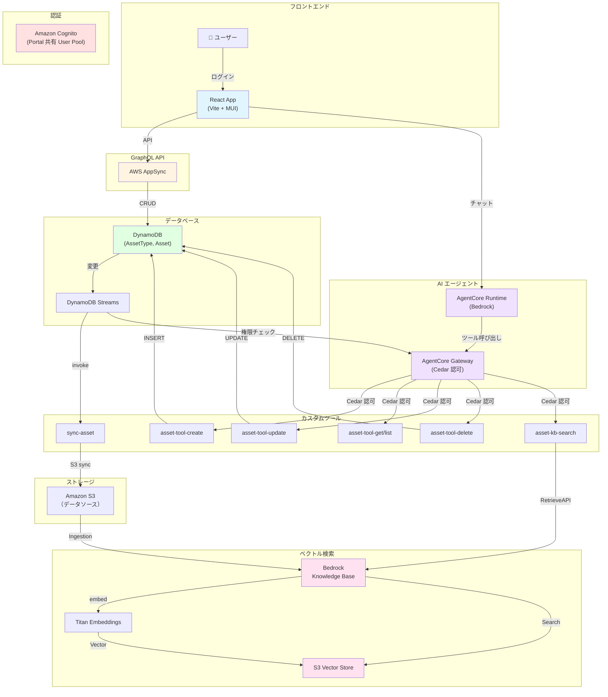

# Asset Catalog - IT資産管理＋AI検索

IT機器などの企業資産を部署単位で管理し、Amazon Bedrock AgentCore と自然言語で検索・操作できるアプリケーション。Cedar Policy によるきめ細かい認可制御を実装。

## 主要機能

### 1. 資産管理

- 資産（IT機器など）の CRUD 操作
- **ステータス管理**: 在庫中(inStock) / 貸出中(lent) / 修理中(inRepair) / 廃棄(disposed)
- 部署単位での管理
- 資産種別（Asset Type）マスタ管理

### 2. AIチャットボット

- **自然言語での検索・操作**
  例: 「在庫中のノートPCは？」「このPCを貸出中に変更して」
- **セッション管理**: 会話履歴を保持
- **Amazon Bedrock AgentCore 統合**: AIエージェントが自動的にツール呼び出し

### 3. セマンティック検索（RAG）

- **DynamoDB Streams 連携**: 資産データの変更をリアルタイムに検知
- **S3 自動同期**: Streams → S3 → Knowledge Base
- **Bedrock Knowledge Base**: ベクトル化・セマンティック検索
- 「贈り物に適したカテゴリは？」のような曖昧な質問にも対応

### 4. Cedar Policy による認可制御

- AgentCore Gateway のツール呼び出しを **Cedar Policy エンジン** で制御
- RBAC（部署×ロール）に加え、より細かい権限定義が可能
- ツール実行レベルでの認可（例：viewerロールは read-only）

---

## 技術スタック

| カテゴリ | 技術 |
|---|---|
| **フロントエンド** | React 18 + TypeScript + Vite |
| **UI** | Material-UI v7 |
| **ルーティング** | React Router v7 |
| **フォーム** | React Hook Form + Zod |
| **認可** | CASL + Cedar Policy |
| **バックエンド** | AWS Amplify Gen2 + CDK |
| **認証** | Amazon Cognito（Portal 共有） |
| **API** | AWS AppSync (GraphQL) |
| **DB** | Amazon DynamoDB + Streams |
| **AI エージェント** | Amazon Bedrock AgentCore |
| **RAG** | Bedrock Knowledge Base |
| **ベクトル化** | Titan Embeddings v1 |
| **ストレージ** | Amazon S3 |

---

## システム構成図



---

## ディレクトリ構成

```
apps/asset-catalog/
├── src/
│   ├── features/
│   │   ├── assets/              # 資産管理機能
│   │   │   ├── components/
│   │   │   │   ├── AssetList.tsx
│   │   │   │   ├── AssetDetail.tsx
│   │   │   │   ├── AssetFormDialog.tsx
│   │   │   │   ├── AssetTypeList.tsx
│   │   │   │   └── AssetTypeFormDialog.tsx
│   │   │   ├── hooks/
│   │   │   │   ├── useAsset.ts
│   │   │   │   ├── useAssets.ts
│   │   │   │   ├── useAssetType.ts
│   │   │   │   └── useAssetTypes.ts
│   │   │   └── schemas/
│   │   │       ├── assetFormSchema.ts
│   │   │       └── assetTypeFormSchema.ts
│   │   └── chatBot/             # AIチャットボット機能
│   │       ├── components/
│   │       │   ├── ChatWidget.tsx
│   │       │   ├── ChatPanel.tsx
│   │       │   ├── SessionList.tsx
│   │       │   └── MessageTraces.tsx
│   │       └── hooks/
│   ├── shared/                  # 共有
│   │   ├── auth/
│   │   ├── components/
│   │   └── types/
│   └── app/
├── amplify/                     # バックエンド定義（スタンドアロン版のみ）
│   ├── auth/
│   ├── data/
│   ├── bedrock/
│   ├── bedrock-agentcore/
│   ├── function/                # Lambda ツール群
│   │   ├── tools/
│   │   │   ├── asset-tool-create/
│   │   │   ├── asset-tool-get/
│   │   │   └── ...
│   │   └── sync-asset/
│   └── backend.ts
└── package.json
```

---

## クイックスタート

### 前提条件

- Node.js 18+
- AWS CLI 設定済み
- Portal（SSO基盤）が同環境にデプロイ済み

### 開発環境のセットアップ

```bash
# ルートから実行
npm install

# Amplify Sandbox を起動（バックエンドデプロイ）
npx ampx sandbox

# 別ターミナルで Asset Catalog を実行
cd apps/asset-catalog
npm run dev
```

ブラウザで http://localhost:5173 にアクセス

### 環境変数設定（スタンドアロン版の場合）

```bash
# .env (スタンドアロン版のみ)
VITE_AGENTCORE_RUNTIME_ARN=arn:aws:bedrock-agentcore:ap-northeast-1:xxx:runtime/xxx
```

---

## ドキュメント

詳細な技術仕様・AI統合方法については以下を参照：

- **[ARCHITECTURE.md](./ARCHITECTURE.md)** - AgentCore 統合・RAG パイプライン・Cedar 認可・技術的チャレンジ

---

## ライセンス

MIT-0 License
