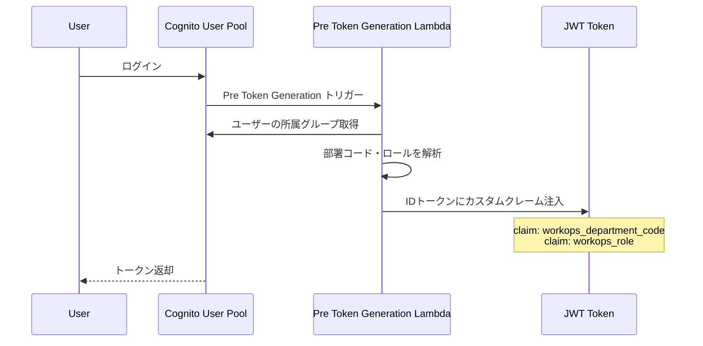
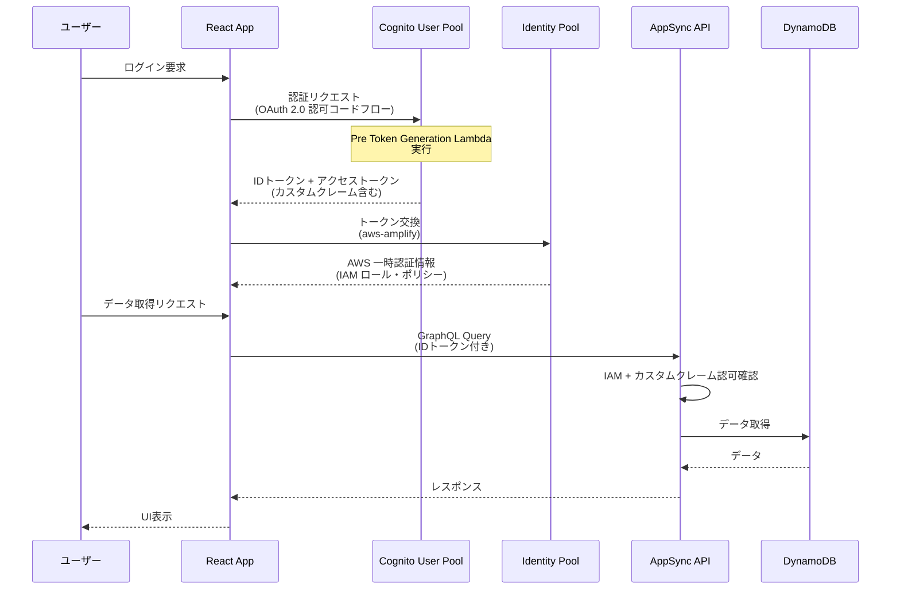
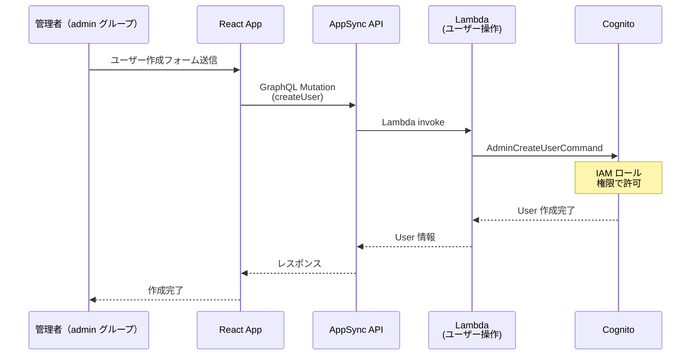

# Portal - アーキテクチャ詳細

このドキュメントでは、Portal の技術的な設計思想と実装の詳細を説明します。

---

## 1. SSO基盤 - Amazon Cognito 設計

### 概要

複数の業務アプリケーション（Asset Catalog、Request Manager）が同一の Amazon Cognito User Pool を共有することで、統合認証を実現しています。

### 共有User Pool

```typescript
// Portal が構築した User Pool
- User Pool Name: workops-suite-{branch}-user-pool
- Region: ap-northeast-1
- OAuth Scope: OPENID, COGNITO_ADMIN
- Login Methods: Email + Username
```

**特徴**:
- Asset Catalog・Request Manager・AgentCore はすべて同一 Amplify デプロイ（shared-backend）内で構築されるため、同一の Cognito User Pool を CDK トークンで直接参照します

---

## 2. ブランチベース環境分離戦略

### 概要

`AWS_BRANCH` 環境変数により、ブランチごとに完全に分離された AWS 環境を構築します。

### 環境分離マッピング

| 環境 | ブランチ | リソース名 | パスプレフィックス |
|---|---|---|---|
| **サンドボックス** | (未設定) | workops-suite-portal-sandbox | workops-suite-sandbox |
| **開発** | dev | workops-suite-portal-dev | workops-suite-dev |
| **ステージング** | staging | workops-suite-portal-staging | workops-suite-staging |
| **本番** | main | workops-suite-portal-main | workops-suite-main |

### メリット

- 各環境が完全分離（同一 AWS アカウント内）
- ブランチごとに独立した User Pool・DynamoDB テーブル・Lambda 関数
- Git push による自動デプロイと環境切り替え

---

## 3. RBAC - 部署×ロール による権限制御

### 概要

Portal では **部署 (Department) × ロール (viewer/editor/manager)** の2軸で権限管理を実現しています。

### ロール定義

| ロール | 説明 | 権限 |
|---|---|---|
| **viewer** | 閲覧者 | 資産・申請の表示のみ |
| **editor** | 編集者 | CRUD 操作（削除除く） |
| **manager** | 管理者 | 全権限 |
| **admin** | グローバル管理者 | ユーザー・部署管理 |

### 実装フロー

#### 1. 部署マスタ登録

```
DynamoDB: Department テーブルに INSERT
         ↓
DynamoDB Stream トリガー
         ↓
Lambda: department-stream-handler 起動
         ↓
Cognito グループ作成
  - {departmentCode}_viewer
  - {departmentCode}_editor
  - {departmentCode}_manager
```

#### 2. Pre Token Generation - JWT にカスタムクレーム注入



**注入されるクレーム**:
```json
{
  "workops_department_code": "dept001",
  "workops_role": "manager"
}
```

#### 3. フロントエンド - CASL による UI 権限制御

```typescript
// Ability 定義（@casl/ability）
export const defineAbility = (userRole: string) => {
  return new AbilityBuilder(AppAbility).define((can, cannot) => {
    if (userRole === 'viewer') {
      can('view', 'all');  // 表示のみ
    } else if (userRole === 'editor') {
      can('create', 'all');
      can('update', 'all');
      cannot('delete', 'all');
    } else if (userRole === 'manager') {
      can('manage', 'all');  // 全権限
    }
  }).build();
};
```

#### 4. DynamoDB - ownerDefinedIn による行レベル認可

```typescript
// AppSync スキーマ例
type Department
  @model
  @auth(rules: [
    { allow: owner, ownerField: "createdBy" }
    { allow: groups, groupsField: "allowedGroups", operations: [read, update] }
  ])
{
  id: ID!
  code: String!
  allowedGroups: [String]  // アクセス可能なグループ
}
```

---

## 4. 認証フロー

### ログイン → API 呼び出しの流れ



### Cognito グループ × Lambda による管理者操作



---

## 5. バックエンド設計

### AppSync + DynamoDB スキーマ

```typescript
// データモデル（DynamoDB）
type Department {
  code: String!           // PK
  name: String!
  sortOrder: Int
  allowedGroups: [String] // RBAC
}

type Project {
  id: ID!                 // PK
  name: String!
  description: String
  urlDomain: String
  iconName: String
  color: String
}

type Page {
  id: ID!
  projectId: ID!          // GSI (projectId)
  name: String!
  relativePath: String
  iconName: String
}
```

### Lambda 関数の役割分担

| Lambda | 機能 | トリガー |
|---|---|---|
| **list-users** | ユーザー一覧取得 | AppSync Query |
| **get-user** | ユーザー詳細取得 | AppSync Query |
| **create-user** | ユーザー作成 | AppSync Mutation |
| **set-user-enabled** | ユーザー有効化/無効化 | AppSync Mutation |
| **delete-user** | ユーザー削除 | AppSync Mutation |
| **department-stream-handler** | 部署登録時にCognitoグループ自動生成 | DynamoDB Stream |
| **pre-token-generation** | JWT にカスタムクレーム注入 | Cognito トリガー |
| **register-callback-url** | Callback URL を Cognito に動的登録 | CustomResource |

---

## 6. 技術的チャレンジと解決策

### 6.1 Feature-Based 設計による保守性

**課題**: 機能増加に伴うコードベース肥大化

**解決策**: 機能単位でディレクトリ分割

```
features/user-management/    # 各機能が独立
├── components/
├── hooks/
├── schemas/
└── utils/
```

**メリット**: 新機能追加時の影響範囲が限定的

---

### 6.2 型安全性の徹底

**課題**: TypeScript の any / unknown による型穴

**解決策**:
- `any` / `unknown` 禁止
- Zod によるランタイムバリデーション
- コーディング規約で強制

```typescript
// 良い例
const userSchema = z.object({
  id: z.string(),
  name: z.string(),
  email: z.string().email(),
});

const createUser = async (data: z.infer<typeof userSchema>) => {
  // 型安全
};
```

---

### 6.3 AppSync エラーハンドリング

**課題**: GraphQL エラーをキャッチ忘れ

**解決策**: try-catch 禁止、errors 配列で判定

```typescript
// 良い例
const result = await client.graphql({ query: listUsers });

if (result.errors) {
  console.error(result.errors[0].message);
  return;
}

const users = result.data.listUsers;
```

---

### 6.4 DynamoDB Streams による部署グループ同期

**課題**: 部署追加時に Cognito グループを手動で作成

**解決策**: DynamoDB Stream トリガーで自動生成

```typescript
// Lambda: department-stream-handler
export const handler = async (event: DynamoDBStreamEvent) => {
  for (const record of event.Records) {
    if (record.eventName === 'INSERT') {
      const department = record.dynamodb!.NewImage!;
      const deptCode = department.code.S!;

      // 3つのグループを作成
      await cognito.createGroup({
        groupName: `${deptCode}_viewer`,
        UserPoolId: USER_POOL_ID,
      });
      await cognito.createGroup({
        groupName: `${deptCode}_editor`,
        UserPoolId: USER_POOL_ID,
      });
      await cognito.createGroup({
        groupName: `${deptCode}_manager`,
        UserPoolId: USER_POOL_ID,
      });
    }
  }
};
```

**メリット**: 運用ミス削減・自動化

---

## 7. セキュリティ設計

### 多層防御

| レイヤー | 機構 | 説明 |
|---|---|---|
| **認証** | Cognito User Pool | OAuth 2.0・MFA対応可 |
| **認可 - API** | IAM ロール・ポリシー | AppSync API の Cognito 認証 |
| **認可 - データ** | DynamoDB ownerDefinedIn | 行レベルアクセス制御 |
| **認可 - UI** | CASL | フロントエンド権限制御 |
| **通信** | HTTPS | CloudFront + TLS 1.2+ |
| **暗号化** | AWS KMS | DynamoDB・Cognito の管理キー暗号化 |

---

## まとめ

Portal は以下の特徴を持つエンタープライズ向け SSO 基盤です：

✅ **拡張性**: 新しい業務アプリが簡単に統合可能
✅ **セキュリティ**: 多層防御・カスタムクレーム・RBAC
✅ **運用効率**: ブランチ環境自動分離・Amplify 一括デプロイ
✅ **保守性**: Feature-Based 設計・型安全性の徹底
✅ **スケーラビリティ**: AWS ネイティブ サービス活用
