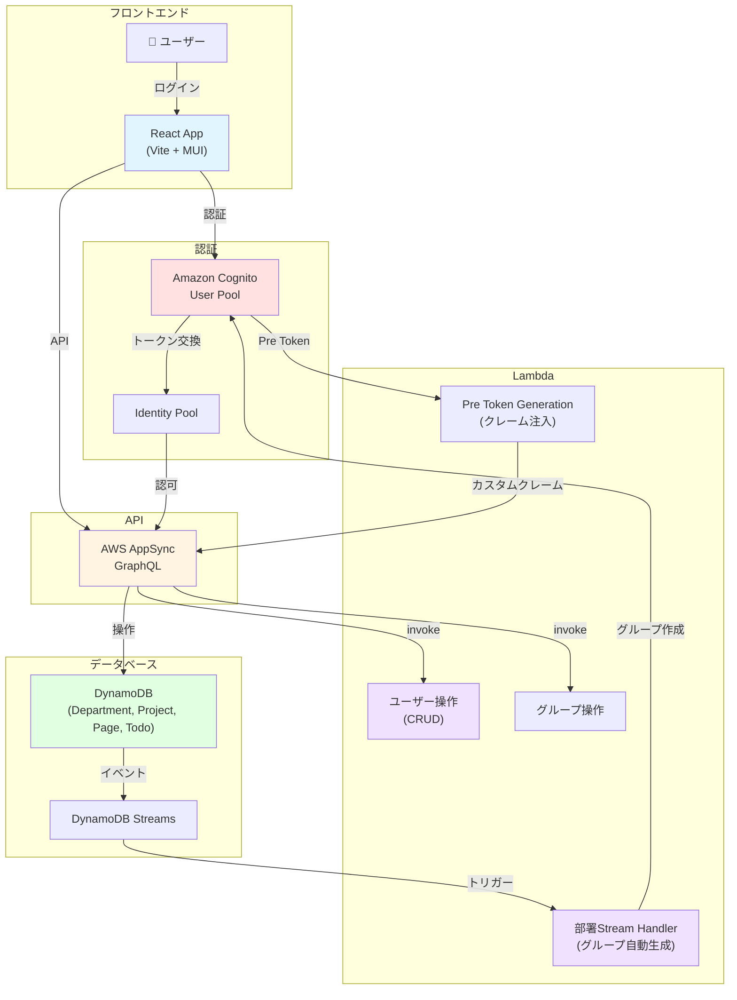

# Portal - エンタープライズSSO基盤

Amazon Cognito ベースのシングルサインオン（SSO）基盤。複数の業務アプリケーション（資産管理、申請管理など）が同一のユーザープールを共有し、統合認証を実現します。

## 主要機能

### 1. SSO認証基盤

- **Amazon Cognito User Pool** による統合認証
- OAuth 2.0 認可コードフロー
- マネージドログイン（Hosted UI）
- 複数のサブシステムでシームレスなログイン体験

### 2. ユーザー管理

- ユーザーの CRUD 操作（作成・表示・有効化・削除）
- 仮パスワード自動生成
- Cognito Admin API による操作

### 3. 部署管理

- 部署マスタの CRUD 操作
- 部署登録時に自動でCognito グループを生成
- 部署×ロール（viewer/editor/manager）の2軸 RBAC

### 4. ポータル機能

- プロジェクト・ページの階層管理
- カスタムアイコン・カラー設定

---

## 技術スタック

| カテゴリ | 技術 |
|---|---|
| **フロントエンド** | React 18 + TypeScript + Vite |
| **UI** | Material-UI v7 |
| **ルーティング** | React Router v7 |
| **フォーム** | React Hook Form + Zod |
| **認可** | CASL |
| **バックエンド** | AWS Amplify Gen2 + CDK |
| **認証** | Amazon Cognito |
| **API** | AWS AppSync (GraphQL) |
| **DB** | Amazon DynamoDB |
| **IaC** | AWS CDK / TypeScript |

---

## システム構成図



---

## ディレクトリ構成

### Feature-Based設計

```
src/
├── features/
│   ├── user-management/       # ユーザー管理機能
│   │   ├── UserManagement.tsx
│   │   ├── components/
│   │   ├── hooks/useUserManagement.ts
│   │   └── schemas/
│   ├── portal/                # ポータル機能
│   │   ├── Portal.tsx
│   │   ├── components/
│   │   └── hooks/
│   ├── department-management/ # 部署管理機能
│   │   ├── DepartmentManagement.tsx
│   │   ├── components/
│   │   └── hooks/
│   └── todo/                  # 参考実装
├── shared/                    # 共有コンポーネント
│   ├── auth/          # 認証・認可（CASL）
│   ├── contexts/      # React Context
│   └── components/
└── app/               # ルーティング・レイアウト
```

---

## クイックスタート

### 前提条件

- Node.js 18+
- AWS CLI 設定済み
- AWS 認証情報設定済み

### 開発環境のセットアップ

```bash
# ルートから実行
npm install

# Amplify Sandbox を起動（バックエンドデプロイ）
npx ampx sandbox

# 別ターミナルで Portal アプリのみ実行
cd apps/portal
npm run dev
```

ブラウザで http://localhost:5173 にアクセス

### デプロイ

```bash
# Git push で自動デプロイ
git push origin main
# → AWS Amplify Hosting が自動ビルド・デプロイ
```

---

## ドキュメント

詳細な技術仕様・設計思想については以下を参照：

- **[ARCHITECTURE.md](./ARCHITECTURE.md)** - SSO基盤・ブランチ環境分離・Pre Token Generation・技術的チャレンジと解決策

---

## ライセンス

MIT-0 License
