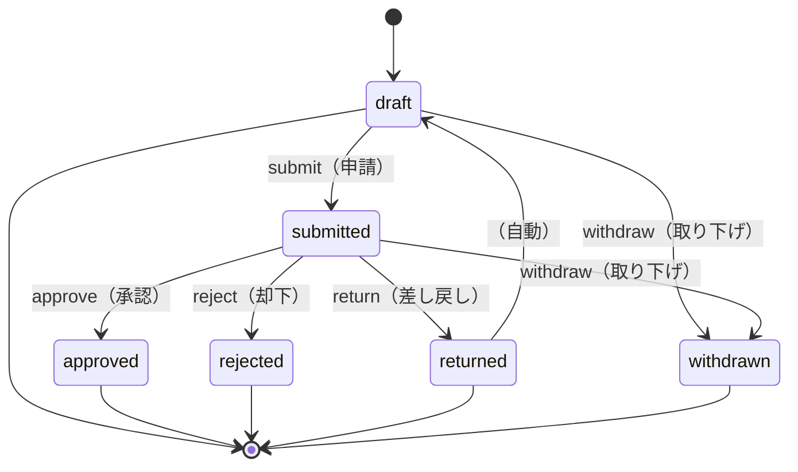
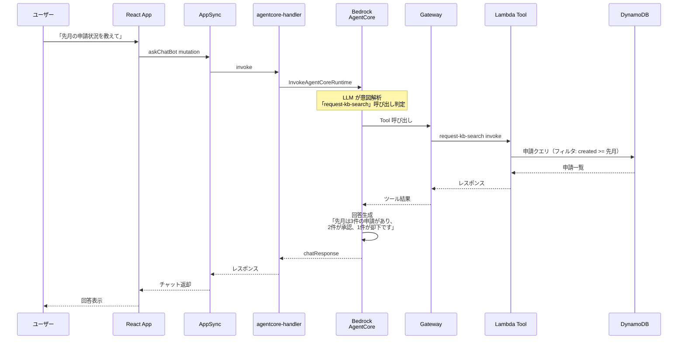

# Request Manager - アーキテクチャ詳細

このドキュメントでは、申請ワークフロー・AI チャットボット・RAG を統合した申請管理アプリの技術設計を説明します。

---

## 1. ワークフロー設計 - 状態遷移管理

### 概要

申請は **strict state machine** として実装。各状態から遷移可能な状態が限定されており、不正な遷移は発生しないよう保証します。

### 状態遷移図



### 実装パターン

#### フロントエンド検証

```typescript
// features/requests/schemas/workflow.ts
const isTransitionAllowed = (
  currentStatus: RequestStatus,
  targetStatus: RequestStatus,
  userRole: string
): boolean => {
  // 例：draft → submitted は誰でも可能
  if (currentStatus === 'draft' && targetStatus === 'submitted') {
    return true;
  }

  // 例：submitted → approved は manager のみ
  if (currentStatus === 'submitted' && targetStatus === 'approved') {
    return userRole === 'manager' || userRole === 'admin';
  }

  // その他の遷移...
  return false;
};
```

#### バックエンド検証（Lambda）

```typescript
// amplify/function/request-tool-update/index.ts
export const handler = async (
  event: UpdateRequestInput
): Promise<UpdateRequestOutput> => {
  const { requestId, targetStatus, reason } = event;

  // DynamoDB から現在の申請を取得
  const request = await getRequest(requestId);
  const currentStatus = request.status;

  // 状態遷移を検証
  if (!isTransitionAllowed(currentStatus, targetStatus)) {
    throw new Error(
      `Cannot transition from ${currentStatus} to ${targetStatus}`
    );
  }

  // reason（理由）が必須な場合
  if (
    (targetStatus === 'rejected' || targetStatus === 'returned') &&
    !reason
  ) {
    throw new Error(`Reason is required for ${targetStatus}`);
  }

  // ステータス更新
  await updateRequest(requestId, {
    status: targetStatus,
    reason,
    updatedAt: new Date().toISOString(),
  });

  return { success: true };
};
```

#### 差し戻し（returned）の処理

```typescript
// 差し戻し時は理由を記録し、自動的に draft へ移行
if (targetStatus === 'returned') {
  await updateRequest(requestId, {
    status: 'draft',
    returnReason: reason,
    returnedAt: new Date().toISOString(),
  });
}
```

---

## 2. DynamoDB スキーマ設計

### RequestType（申請種別マスタ）

```typescript
type RequestType {
  id: ID!                  // PK: UUID
  departmentId: String!    // GSI1 PK
  code: String!            // "EXPENSE" など
  name: String!            // 「経費申請」
  description: String
  isActive: Boolean!       // true: 使用可能
  sortOrder: Int
  createdAt: AWSDateTime!
  updatedAt: AWSDateTime!
}
```

### Request（申請）

```typescript
type Request {
  id: ID!                  // PK: UUID
  departmentId: String!    // GSI1 PK
  requestTypeId: ID!       // RequestType 参照
  requesterSub: String!    // 申請者のユーザーID（Cognito sub）
  status: RequestStatus!   // draft / submitted / approved / rejected / returned / withdrawn

  // 申請内容
  title: String!           // 申請タイトル
  description: String      // 詳細説明
  amount: Float            // 金額（経費申請の場合）
  reason: String           // 申請理由

  // ワークフロー関連
  submittedAt: AWSDateTime       // 申請日時
  approverSub: String            // 承認者のユーザーID
  approvedAt: AWSDateTime        // 承認日時
  rejectionReason: String        // 却下理由
  rejectedAt: AWSDateTime        // 却下日時
  returnReason: String           // 差し戻し理由
  returnedAt: AWSDateTime        // 差し戻し日時

  createdAt: AWSDateTime!
  updatedAt: AWSDateTime!
}

enum RequestStatus {
  draft                    # 下書き
  submitted                # 申請済み
  approved                 # 承認
  rejected                 # 却下
  returned                 # 差し戻し
  withdrawn                # 取り下げ
}
```

### 権限制御

```typescript
type Request @auth(rules: [
  // 申請者本人
  { allow: owner, ownerField: "requesterSub" }

  // 部署の manager / admin
  { allow: groups, groupsField: "allowedGroups", operations: [read, update] }

  // グローバル admin
  { allow: groups, groupsClaim: "cognito:groups", groups: ["admin"] }
])
```

---

## 3. AgentCore 統合 - AI チャットボット

### ツール呼び出しフロー



### Lambda ツール群

| ツール | 説明 | 実行可能ロール |
|---|---|---|
| `request-tool-list` | 申請一覧（フィルタ可） | viewer / editor / manager |
| `request-tool-get` | 申請詳細 | viewer / editor / manager |
| `request-tool-create` | 申請作成 | editor / manager |
| `request-tool-update` | ステータス変更 | editor / manager（者により異なる） |
| `request-type-tool-list` | 申請種別一覧 | viewer / editor / manager |
| `request-kb-search` | Knowledge Base 検索 | viewer / editor / manager |

---

## 4. RAG パイプライン

### リアルタイムベクトル更新

```
DynamoDB: Request 更新
        ↓
DynamoDB Streams
        ↓
Lambda: sync-request トリガー
        ↓
S3: 申請テキスト保存
        ↓
Bedrock Knowledge Base: Ingestion Job
        ↓
Titan Embeddings: ベクトル化
        ↓
S3 Vector Store: 保存
        ↓
（セマンティック検索時）
Bedrock KB RetrieveAPI
        ↓
S3 Vector Store: ベクトル検索
```

### Lambda: sync-request の実装

```typescript
// amplify/function/sync-request/index.ts
export const handler = async (event: DynamoDBStreamEvent) => {
  const s3Client = new S3Client({ region: "ap-northeast-1" });

  for (const record of event.Records) {
    if (record.eventName !== 'MODIFY' && record.eventName !== 'INSERT') continue;

    const request = record.dynamodb!.NewImage!;
    const requestId = request.id.S!;

    // 申請テキスト作成（RAG 用）
    const requestText = `
      Request ID: ${requestId}
      Type: ${request.requestTypeId.S}
      Status: ${request.status.S}
      Title: ${request.title.S}
      Amount: ${request.amount?.N || 'N/A'}
      Reason: ${request.reason?.S || ''}
      Submitted: ${request.submittedAt?.S || 'Not submitted'}
      Approval Status: ${request.approvedAt ? 'Approved' : 'Pending'}
    `;

    // S3 に保存
    await s3Client.send(
      new PutObjectCommand({
        Bucket: KB_DATA_SOURCE_BUCKET,
        Key: `requests/${requestId}.txt`,
        Body: requestText,
      })
    );
  }
};
```

### セマンティック検索の例

```
ユーザー: 「高額な申請を全部見せて」

Knowledge Base 検索:
  1. 「高額（金額が高い）」をベクトル化
  2. S3 Vector Store との類似度計算
  3. amount が多い申請を重点的に取得

結果: 金額 100万円以上の申請 2 件
```

---

## 5. ReasonDialog - 理由入力コンポーネント

### UI 実装

```typescript
// features/requests/components/ReasonDialog.tsx
interface ReasonDialogProps {
  open: boolean;
  action: 'reject' | 'return';  // 却下 or 差し戻し
  onConfirm: (reason: string) => void;
  onCancel: () => void;
}

export const ReasonDialog: React.FC<ReasonDialogProps> = ({
  open,
  action,
  onConfirm,
  onCancel,
}) => {
  const [reason, setReason] = useState('');

  const handleConfirm = () => {
    if (!reason.trim()) {
      alert('理由を入力してください');
      return;
    }
    onConfirm(reason);
  };

  return (
    <Dialog open={open} onClose={onCancel}>
      <DialogTitle>
        {action === 'reject' ? '却下理由' : '差し戻し理由'}を入力
      </DialogTitle>
      <DialogContent>
        <TextField
          multiline
          rows={4}
          value={reason}
          onChange={(e) => setReason(e.target.value)}
          fullWidth
          placeholder="理由を入力してください"
        />
      </DialogContent>
      <DialogActions>
        <Button onClick={onCancel}>キャンセル</Button>
        <Button onClick={handleConfirm} color="error">
          {action === 'reject' ? '却下' : '差し戻し'}
        </Button>
      </DialogActions>
    </Dialog>
  );
};
```

### 使用例

```typescript
// RequestDetail.tsx から
const handleReject = async () => {
  setShowReasonDialog(true);
  setReasonAction('reject');
};

const handleConfirmRejection = async (reason: string) => {
  const result = await client.graphql({
    mutation: updateRequest,
    variables: {
      id: request.id,
      status: 'rejected',
      rejectionReason: reason,
    },
  });

  if (!result.errors) {
    showNotification('申請を却下しました');
  }
};
```

---

## 6. 技術的チャレンジと解決策

### 6.1 複雑なワークフロー管理

**課題**: 状態遷移のルール複雑化 → バグ誘発

**解決策**:
- state machine パターン（TypeScript 型で状態遷移を制限）
- ユニットテスト: 各遷移が正しく実行されるか検証
- ステート遷移図を Mermaid で可視化

```typescript
// ユニットテスト例
describe('Request Workflow', () => {
  it('should allow draft → submitted', () => {
    expect(isTransitionAllowed('draft', 'submitted')).toBe(true);
  });

  it('should not allow submitted → draft', () => {
    expect(isTransitionAllowed('submitted', 'draft')).toBe(false);
  });

  it('should reject without reason', () => {
    expect(() => rejectRequest(requestId, null)).toThrow();
  });
});
```

---

### 6.2 承認フローの権限管理

**課題**: submitted 状態での「承認」は manager のみが実行可能

**解決策**:
- AppSync mutation で IAM 認可チェック
- DynamoDB ownerDefinedIn での行レベル制御
- Lambda では role チェック

```typescript
// Lambda: request-tool-update の権限チェック
if (targetStatus === 'approved') {
  const userRole = event.userContext.claims['workops_role'];
  if (!['manager', 'admin'].includes(userRole)) {
    throw new Error('Only managers can approve requests');
  }
}
```

---

### 6.3 長時間実行の申請処理

**課題**: 大量の申請を一括処理する際、Lambda がタイムアウト

**解決策**:
- DynamoDB Streams による非同期バッチ処理
- SQS キューで複数の Lambda を並列実行
- Step Functions での長時間ワークフロー管理

---

### 6.4 監査ログ

**課題**: 申請の変更履歴（誰が、いつ、何を承認したか）を記録

**解決策**:
- DynamoDB に AuditLog テーブルを追加
- Lambda で各操作を記録

```typescript
type AuditLog {
  id: ID!
  requestId: ID!
  action: String!           // approve / reject / return
  performedBy: String!      // ユーザーID
  previousStatus: String
  newStatus: String
  reason: String
  timestamp: AWSDateTime!
}
```

---

## 7. セキュリティ設計

### 多層防御

| レイヤー | 機構 | 説明 |
|---|---|---|
| **認証** | Cognito User Pool | Portal 共有 |
| **認可 - API** | AppSync IAM | GraphQL エンドポイント |
| **認可 - ツール** | Gateway（基本） | AgentCore ツール呼び出し |
| **認可 - データ** | DynamoDB ownerDefinedIn | 行レベルアクセス制御 |
| **認可 - UI** | CASL | フロントエンド権限表示 |

---

## 8. デプロイメント

### モノレポ版

```bash
# ルートで実行
npm install
npx ampx sandbox
cd apps/request-manager
npm run dev
```

### スタンドアロン版（実験・開発用）

```bash
cd C:\git\workops\workops-suite-request-manager\
npx ampx sandbox
```

**注意**: モノレポが本番推奨。

---

## まとめ

Request Manager は以下の特徴を持つワークフロー型申請管理システムです：

✅ **Strict State Machine**: 不正な状態遷移を防止
✅ **AI チャットボット**: 自然言語での申請操作
✅ **RAG**: セマンティック検索による高度な照会
✅ **Audit Trail**: 監査ログによる透明性確保
✅ **多層権限制御**: API・ツール・データレベルの3層防御
✅ **スケーラビリティ**: AWS ネイティブ サービス活用
