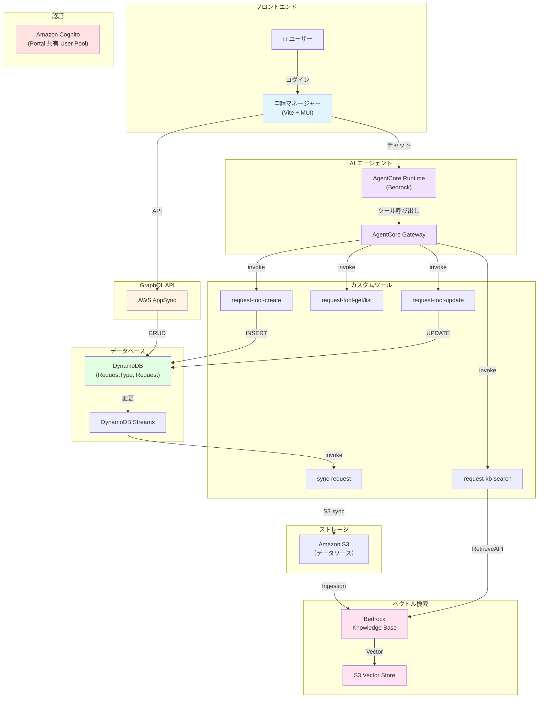

# Request Manager - 申請管理＋AI支援

経費申請などのワークフロー型申請を部署単位で管理し、Amazon Bedrock AgentCore による自然言語サポートで申請検索・ステータス更新ができるアプリケーション。

## 主要機能

### 1. 申請管理

- 申請（Request）の CRUD 操作
- **ワークフロー管理**: draft → submitted → approved / rejected / returned / withdrawn
- 申請種別（Request Type）マスタ管理
- 部署単位での管理

### 2. ワークフロー制御

- **ステートマシン**: 厳密な状態遷移ルール
  - draft（下書き）: 編集・削除可能
  - submitted（申請済み）: 承認者による審査
  - approved（承認）: 終了状態
  - rejected（却下）: 終了状態
  - returned（差し戻し）: 理由付きで下書きへ戻す
  - withdrawn（取り下げ）: 申請者が取り下げ可能

### 3. 承認・却下理由入力

- ReasonDialog により、却下・差し戻し時に理由を記録
- 監査ログとして利用可能

### 4. AIチャットボット

- **自然言語での申請検索・操作**
  例: 「先月の申請は？」「この申請を承認して」
- **セッション管理**: 会話履歴を保持
- **Amazon Bedrock AgentCore 統合**

### 5. セマンティック検索（RAG）

- DynamoDB Streams 連携：申請データの変更をリアルタイムに検知
- S3 自動同期 + Bedrock Knowledge Base
- 「金額が高い申請」のような条件付き検索に対応

---

## 技術スタック

| カテゴリ | 技術 |
|---|---|
| **フロントエンド** | React 18 + TypeScript + Vite |
| **UI** | Material-UI v7 |
| **ルーティング** | React Router v7 |
| **フォーム** | React Hook Form + Zod |
| **認可** | CASL |
| **バックエンド** | AWS Amplify Gen2 + CDK |
| **認証** | Amazon Cognito（Portal 共有） |
| **API** | AWS AppSync (GraphQL) |
| **DB** | Amazon DynamoDB + Streams |
| **AI エージェント** | Amazon Bedrock AgentCore |
| **RAG** | Bedrock Knowledge Base |
| **ストレージ** | Amazon S3 |

---

## システム構成図



---

## ディレクトリ構成

```
apps/request-manager/
├── src/
│   ├── features/
│   │   ├── requests/             # 申請管理機能
│   │   │   ├── components/
│   │   │   │   ├── RequestList.tsx
│   │   │   │   ├── RequestDetail.tsx
│   │   │   │   ├── RequestForm.tsx
│   │   │   │   └── ReasonDialog.tsx
│   │   │   ├── hooks/
│   │   │   │   ├── useRequest.ts
│   │   │   │   ├── useRequests.ts
│   │   │   │   └── useRequestTypes.ts
│   │   │   ├── schemas/
│   │   │   │   └── workflow.ts      # ステート遷移定義
│   │   │   └── types/
│   │   ├── admin/                # 管理者機能
│   │   │   ├── components/
│   │   │   │   ├── RequestTypeList.tsx
│   │   │   │   └── RequestTypeFormDialog.tsx
│   │   │   └── hooks/
│   │   │       └── useRequestTypes.ts
│   │   └── chatBot/              # AIチャットボット機能
│   │       ├── components/
│   │       │   ├── ChatWidget.tsx
│   │       │   ├── ChatPanel.tsx
│   │       │   ├── SessionList.tsx
│   │       │   └── MessageTraces.tsx
│   │       └── hooks/
│   ├── shared/
│   │   ├── auth/
│   │   ├── components/
│   │   └── types/
│   └── app/
├── amplify/                      # バックエンド定義（スタンドアロン版のみ）
│   ├── auth/
│   ├── data/
│   ├── bedrock/
│   ├── bedrock-agentcore/
│   ├── function/
│   │   ├── tools/
│   │   │   ├── request-tool-create/
│   │   │   ├── request-tool-get/
│   │   │   └── ...
│   │   └── sync-request/
│   └── backend.ts
└── package.json
```

---

## ワークフロー定義

### 申請のライフサイクル

```
┌─────────┐
│  draft  │ ← 作成直後・下書き状態
└────┬────┘
     │ 申請者が「送信」
     ↓
┌──────────┐
│submitted │ ← 承認者の審査待ち
└────┬─────┘
     ├─ 「承認」→ approved（終了）
     ├─ 「却下」→ rejected（終了）
     ├─ 「差し戻し」→ draft（編集対象）
     └─ 申請者が「取り下げ」→ withdrawn（終了）
```

### ステート遷移ルール（TypeScript）

```typescript
// features/requests/schemas/workflow.ts
export const requestWorkflow = {
  draft: {
    submittable: true,           // submit 可能
    editable: true,              // 編集可能
    deletable: true,             // 削除可能
    allowedTransitions: ['submitted', 'withdrawn'],
  },
  submitted: {
    submittable: false,
    editable: false,
    deletable: false,
    allowedTransitions: ['approved', 'rejected', 'returned'],
  },
  approved: {
    submittable: false,
    editable: false,
    deletable: false,
    allowedTransitions: [],      // 終了状態
  },
  rejected: {
    submittable: false,
    editable: false,
    deletable: false,
    allowedTransitions: [],      // 終了状態
  },
  returned: {
    submittable: false,
    editable: false,
    deletable: false,
    allowedTransitions: [],      // 実装上は draft へ戻る
  },
  withdrawn: {
    submittable: false,
    editable: false,
    deletable: false,
    allowedTransitions: [],      // 終了状態
  },
};

// 遷移関数
export const canTransition = (currentStatus: RequestStatus, targetStatus: RequestStatus): boolean => {
  return requestWorkflow[currentStatus].allowedTransitions.includes(targetStatus);
};
```

---

## クイックスタート

### 前提条件

- Node.js 18+
- AWS CLI 設定済み
- Portal（SSO基盤）が同環境にデプロイ済み

### 開発環境のセットアップ

```bash
# ルートから実行
npm install

# Amplify Sandbox を起動（バックエンドデプロイ）
npx ampx sandbox

# 別ターミナルで Request Manager を実行
cd apps/request-manager
npm run dev
```

ブラウザで http://localhost:5173 にアクセス

---

## ドキュメント

詳細な技術仕様・ワークフロー設計については以下を参照：

- **[ARCHITECTURE.md](./ARCHITECTURE.md)** - AgentCore 統合・ワークフロー状態遷移・RAG・技術的チャレンジ

---

## ライセンス

MIT-0 License
